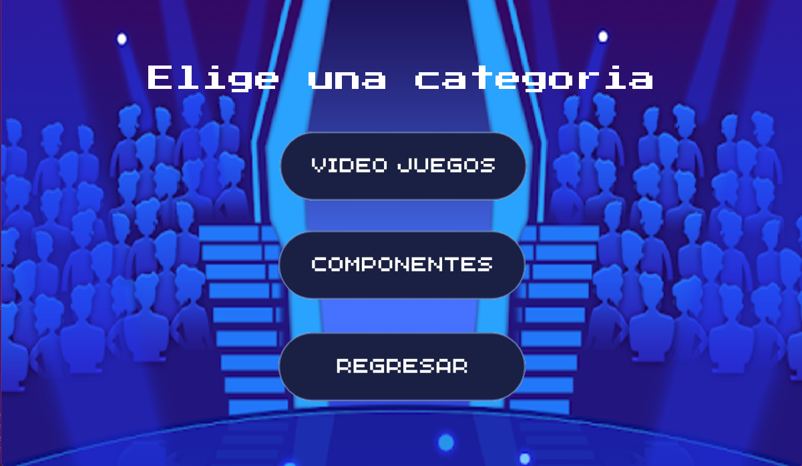
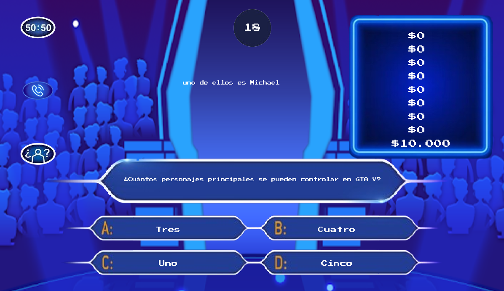

  <h1> :dart: Quien quiere ser millonario :dart:</h1> 

## :octocat: Integrantes 
- Cortes Malena
- Celis Marilyn

## :link: Link al proyecto
- [Gameplay](https://youtu.be/0ecRS4OHXCM?si=Tsl9w0mXD58-8HUn)

## :video_game: Juego 

## Descripción 
Es un juego de trivia que hace referencia al famoso programa de televisión "¿Quien quiere ser millonario?", tendrás un menu, la opcion de elegir de categoría, el de poder cargar tu usuario y poder jugar respondiendo las preguntas indicadas en la ventana. Tambien podrás usar comodines que te ayudan dandote una pista, eliminandote dos respuestas o mismo dandole un porcentaje. El juego acabara si te equivocas, superas el tiempo establecido, deseas salir o ganas. 

## Estructura del Proyecto

El proyecto está organizado en varios módulos para mantener el código limpio y fácil de mantener:

1. **actualizar.py**: Contiene funciones que actualizan la pantalla del juego.
2. **button_class.py**: Maneja la creación de botones e interracion del usuario con botones.
3. **dibujar.py**: Contiene funciones que dibuja la información en pantalla.
4. **funciones.py**: Maneja la obtención de preguntas progresivas y determina la ultima ganancia.
5. **manejar_eventos.py**: Maneja los eventos del mouse de las categorias, comodines y el menú.
6. **pregunta_class.py**: Maneja la lógica de cada pregunta del juego, verifica, calcula y funciones de ayuda de comodines .
7. **main.py**: Punto de entrada del programa que coordina todas las operaciones.

    
    

# Función principal
Esta es la funcion principal del juego donde establecemos todos los valores necesarios primero para luego hacer las respectivas llamadas a eventos en el while, donde los comodines son tratados aparte de las opciones correctas o incorrectas para manejar de mejor manera los eventos que se realizan y sus retornos diferentes. Ademas contamos con una constante actualizacion de pantalla y establecemos 15 fps por segundo

~~~ Python
def video_juegos():
    cantidad_preguntas = 0
    
    N = 1
    M = len(preguntas_respuestas["videojuegos"])
    matriz_ganancias = [[0]*N for _ in range(M)]
    
    lista_comodines = ["imagenes\comodines\comodin_cincuenta.png","imagenes\comodines\comodin_llamada.png","imagenes\comodines\comodin_publico.png"]
    # comodines
    comodin = Button((90,70),"Vertical",lista_comodines)
    recurso_comodin = None
    
    lista_banderas = [True, True, True]

    lista_ultima_ganancia.pop(0)
    ultima_ganancia = 0
    
    clock = pygame.time.Clock()
    tiempo_inicial = pygame.time.get_ticks()
    
    while True:
        pregunta = obtener_preguntas_progresivas(preguntas_respuestas["videojuegos"],cantidad_preguntas)
        
        mouse_posicion = pygame.mouse.get_pos()
        
        if recurso_comodin == None:
          recurso_comodin = obtener_evento_comodines(comodin, pregunta, lista_pistas, lista_banderas, mouse_posicion, recurso_comodin)
        
        actulizar_pantalla_preguntas(ventana, background,background_opciones, 10 ,BLANCO, None, pregunta, comodin, matriz_ganancias, recurso_comodin)
        
        evento = obtener_evento_videojuegos(pregunta, matriz_ganancias, mouse_posicion, cantidad_preguntas, ultima_ganancia)
        if evento == "correcta":
            tiempo_inicial = pygame.time.get_ticks()
            ultima_ganancia = determinar_ultima_ganancia(matriz_ganancias, lambda ganacia: ganacia != 0)
            recurso_comodin = None
            cantidad_preguntas += 1
            
        elif evento == "incorrecta":
            lista_ultima_ganancia.append(ultima_ganancia)
            perdedor()    
         
        tiempo_actual = pygame.time.get_ticks()
        tiempo_transcurrido = round((tiempo_actual - tiempo_inicial) * 0.001)
        
        if tiempo_transcurrido == 30:
            lista_ultima_ganancia.append(ultima_ganancia)
            perdedor()

        if cantidad_preguntas == len(preguntas_respuestas["videojuegos"]):
            ultima_ganancia = determinar_ultima_ganancia(matriz_ganancias,lambda ganancia: ganancia != 0) + 1
            lista_ultima_ganancia.append(ultima_ganancia)
            ganador()
        
        dibujar_imagen(ventana,"imagenes\Background_contador.png",(600,70))
        dibujar_texto(ventana,str(tiempo_transcurrido),20,BLANCO, None,(600,70) ) 
      
        comodin.mostrar_boton(ventana)
      
        pygame.display.update()
        
        clock.tick(15)
~~~

## Clases
Contamos con dos clases:

Class pregunta
~~~ Python
class Pregunta: 
    def __init__(self, diccionario: dict, tamano_fuente,color_texto,) -> None: 
        # variables de instancia
        self.pregunta = diccionario["pregunta"] 
        self.opciones = diccionario["opciones"]
        self.correcta = diccionario["correcta"]
        self.dificultad = diccionario["dificultad"]
        self.posicion_x_inicial = 400
        self.posicion_y_inicial = 550  # posicion inicial
        self.tamano_fuente = tamano_fuente
        self.color_texto = color_texto
        # rectangulo de cada opcion
        self.recta = []
        self.texto = []
        for i in range(len(self.opciones)):
            texto = get_font(tamano_fuente).render(self.opciones[i], True, color_texto)
            recta_texto  = texto.get_rect(center=(self.posicion_x_inicial, self.posicion_y_inicial))
            self.texto.append(texto)
            self.recta.append(recta_texto)
        self.actualizar_rectas()
~~~
Dirigida a todo aquel manejo de preguntas, opciones y los comodines utilizados 

Class Button
~~~ Python
class Button(): #mostrar 
    def __init__(self, posicion,orientacion,imagen_url):
        self.posicion_x_inicial = posicion[0]
        self.posicion_y_inicial = posicion[1]
        self.orientacion = orientacion
        self.recta = []
        self.imagen_load = []
        self.imagen = imagen_url
        for i in range(len(self.imagen)):
            imagen_load = pygame.image.load(self.imagen[i])
            recta_imagenes  = imagen_load.get_rect(center=(self.posicion_x_inicial, self.posicion_y_inicial))
            self.imagen_load.append(imagen_load)
            self.recta.append(recta_imagenes)
        self.actualizar()
~~~
Dirigida a todos aquellos botones necesarios a mostrar en pantalla 

  

 
  

  

